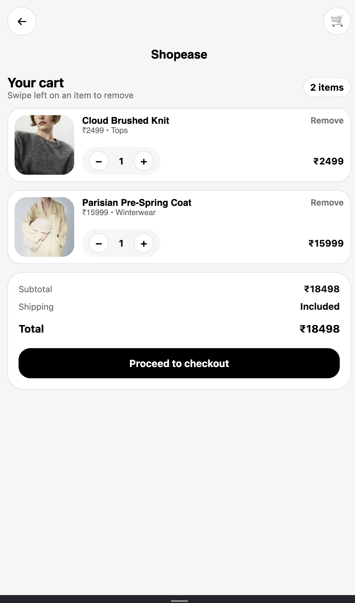
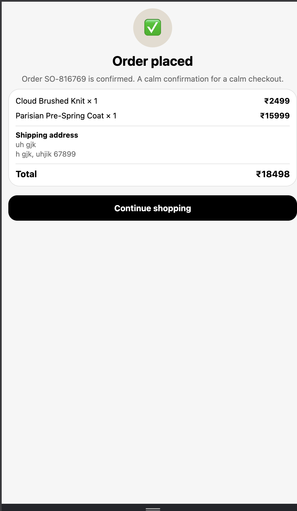

# 🛍️ Shopease - E-Commerce Mobile App

A modern, minimalist e-commerce mobile application built with **React Native** and **Expo**. This app provides a seamless shopping experience with product browsing, cart management, and a multi-step checkout flow.

---

## 🎬 Demo Video

  <video width="320" height="640" controls autoplay muted loop playsinline>
    <source src="https://github.com/user-attachments/assets/ec299263-ffc0-4cf8-8439-1e1e5d72ad10" type="video/mp4" />
    Your browser does not support the video tag.
  </video>

---

## 📱 Screenshots

  
  &nbsp;&nbsp;&nbsp;
  
  &nbsp;&nbsp;&nbsp;
  

<table align="center">
  <tr>
    <th>Home Screen</th>
    <th>Cart</th>
    <th>Checkout</th>
  </tr>
  <tr>
    <td align="center">Browse products with search</td>
    <td align="center">Manage cart items</td>
    <td align="center">Multi-step checkout</td>
  </tr>
</table>

---

## ✨ Features

| Feature | Description |
|--------|-------------|
| 🔍 **Product Search** | Real-time search filtering by name and category |
| 🛒 **Shopping Cart** | Add, remove, and update quantities with swipe gestures |
| 📦 **Product Details** | Full product view with size selection |
| 💳 **Multi-step Checkout** | User details, shipping address, and payment selection |
| 💾 **Persistent Cart** | Cart data saved locally using AsyncStorage |
| 🎨 **Clean UI** | Modern, minimalist design with smooth animations |
| 💰 **INR Currency** | Prices displayed in Indian Rupees (₹) |

---

## 🛠️ Tech Stack

| Technology | Purpose |
|------------|--------|
| **React Native 0.81** | Cross-platform mobile framework |
| **Expo SDK 54** | Development toolchain & build system |
| **TypeScript 5.9** | Type-safe development |
| **React Navigation 7** | Native stack navigation |
| **React Context API** | Global state management |
| **AsyncStorage** | Local data persistence |
| **React Native Gesture Handler** | Swipe-to-delete functionality |

---

## 🏗️ State Management Approach

This app uses **React Context API** for global state management.

